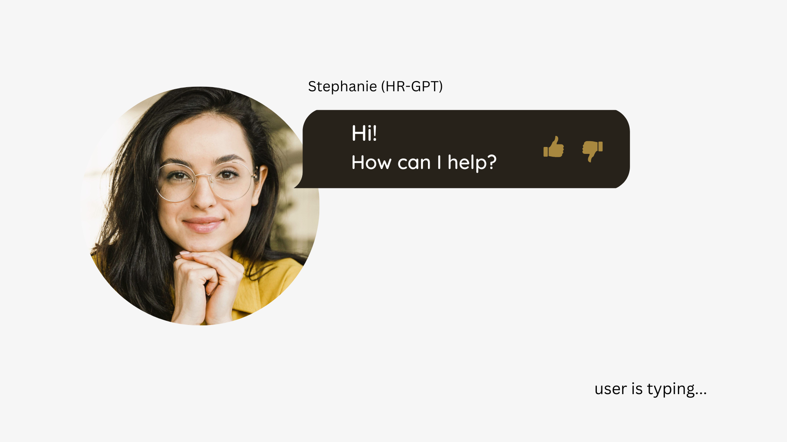
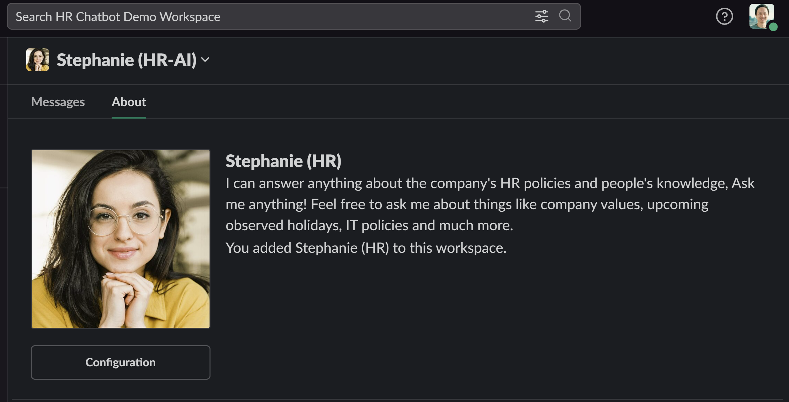
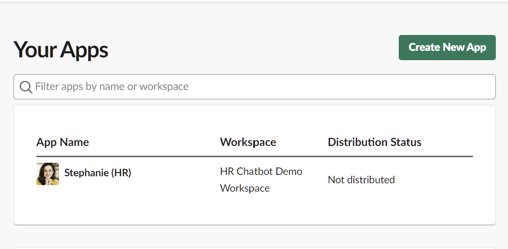
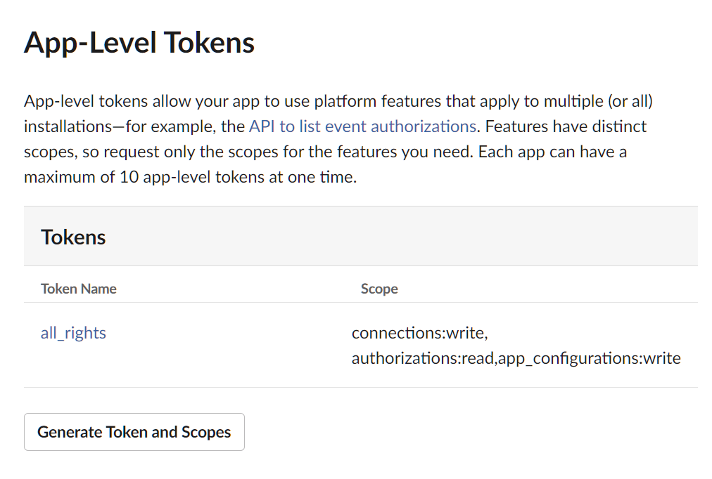
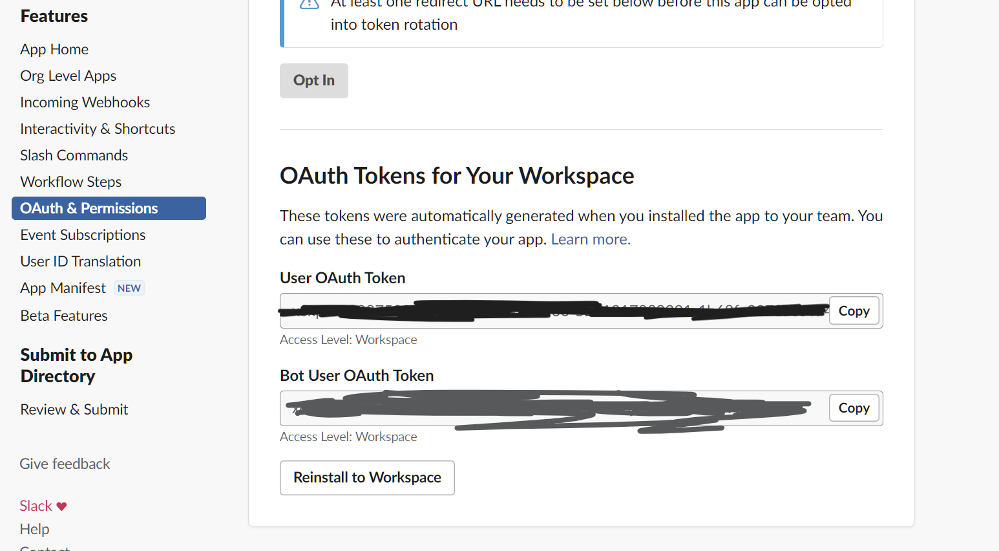
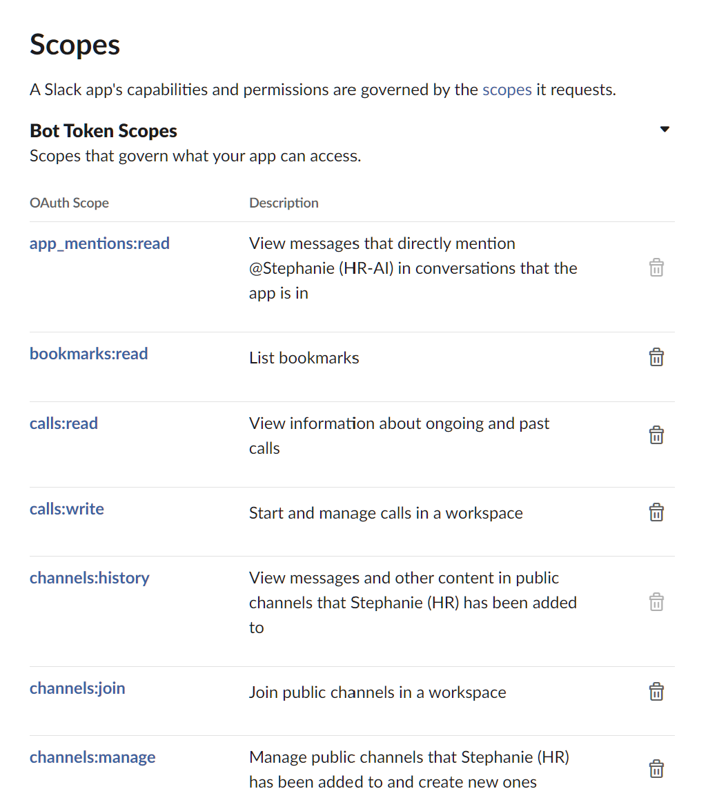
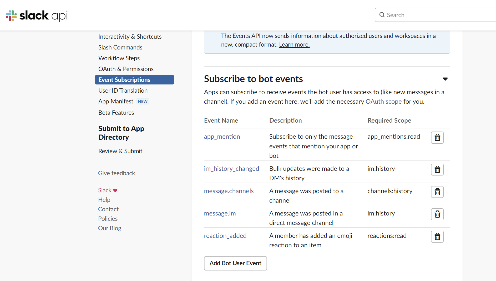
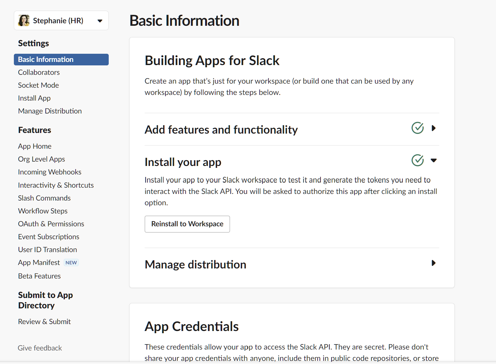
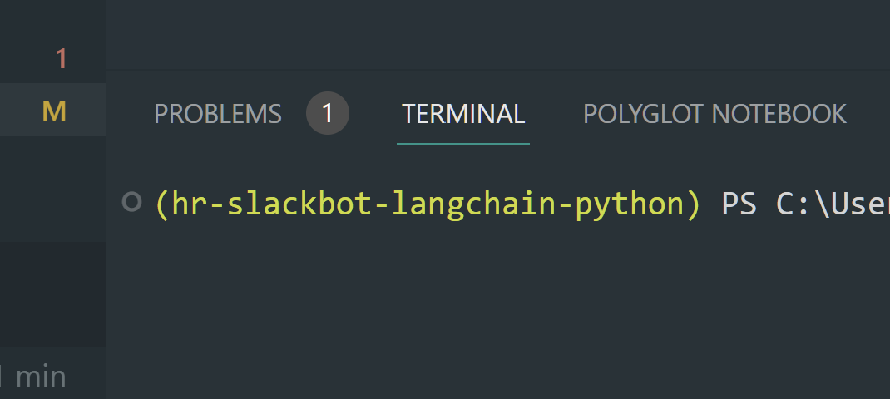

# HR-GPT (Your friendly HR Slack AI Agent)

- [Check out the live demo here ](https://join.slack.com/t/hrchatbotdemo-bn49531/shared_invite/zt-1uhxtfou8-OnQc6Xwmv9eS7GFkL8m~EA)

## Why does this exist?



As remote workers, we know the pain of starting a new job and having a million questions about the company. We're under pressure to get up to speed quickly, but we also don't like to bother the HR or recruiters too much. So we're stuck!

As HR, you're probably tired of answering the same questions over and over again. You want to help your new hires, but you also have a million other things to do. Worse, there might be hundreds of new hired in this batch and they're all asking the same questions! You're tired!


HR-GPT can be the bridge between you and your new hired. She'll also stick around throughout the onboarding period into the 1-month, 3-month and 6-month marks to make sure your hires are cared for.



## Tech overview

- [Check out the live demo here ](https://join.slack.com/t/hrchatbotdemo-bn49531/shared_invite/zt-1uhxtfou8-OnQc6Xwmv9eS7GFkL8m~EA)
- The Slackbot runs from `main.py`
- LangChain agent, LLMChain and RetrievalQA are used to answer questions
- The agent receives a question and pick the best tool for the job (introduce itself, query the knowledge base, or calculate stock vesting schedule)
- User can quickly update current knowledge vectorstore by uploading files directly through Slack or pasting URLs in using a slash (/) command.
- OpenAI's gpt-3.5-turbo is used for both LLM and embedding operations

## Getting Started

- Prerequisites

  - Python 3.10.5 or newer
  - `pip` installed
  - [OpenAI account & API key](https://platform.openai.com/)
  - Slack account, test workspace, bot & app token

- Setup Slack App and get tokens

  - Sign up for [Slack](https://slack.com/get-started#/createnew)

  - Go to [api.slack.com](api.slack.com)

  - Create a new Slack app

    

  - Get and save the app's token (later to put in `.env` file)

    

  - Get and save the bot's token (later to put in `.env` file)

    

  - Give the bot enough OAuth & Permissions scopes

    - Bot token scopes

      

      The scopes needed are: `app_mentions:read`, `channels:history`, `channels:join`, `channels:read`, `chat:write`, `chat:write.customize`, `chat:write.public`, `conversations.connect:read`, `conversations.connect:write`, `groups:history`, `groups:read`, `im:history`, `im:read`, `im:write`, `im:write.invites`, `im:write.topic`, `incoming-webhook`, `links:write`, `metadata.message:read`, `mpim:history`, `mpim:read`, `mpim:write`, `reactions:read`, `reactions:write`, `users:read`, `users:read.email`, `users:write`

    - User token scopes

      

      The scopes needed are: `im:history`, `im:read`, `im:write`, `im:write.invites`, `im:write.topic`, mpim:history, `mpim:read`, `mpim:write`, `reactions:read`, `reactions:write`

  - Subscribe to events

    

    The events are: `app_mention`, `app_mentions:read`, `im_history_changed`, `im:history`, `message.channels`, `channels:history`, `message.im`, `im:history`, `reaction_added`

  - Install the Slack app in a workspace

    - Install it to an existing workspace that you're already part of or create a new one and install the app in it.

      

- Setup project

  - Create a new `.env` file
  - Put in these details (the first line is to automatically activate the virtual env when you open the terminal)

    ```
    source hr-gpt/bin/activate

    OPENAI_API_KEY=
    SLACK_APP_TOKEN=
    SLACK_BOT_TOKEN=
    ```

  - Create a new Python virtual environment

    - `python -m venv hr-gpt` (Mac)
    - `py -m venv hr-gpt` (Windows 11)

  - Start virtual environment manually by running: `source hr-gpt/bin/activate` (Mac)

    - Or start it automatically by opening a new Terminal or Powershell and entering the project's directory.

  - Install Python requirements in the project repository: `pip install -r requirements.txt`

    - If new dependencies are added, add them manually to `requirements.txt`

## Start development

- Make sure you're in the Python virtual environment (which is indicated by the name of the env in your Terminal/Powershell)

  

- Start the app by running: `python main.py` (Mac) or `py main.py` (Windows 11)

## Checking logs on Heroku

- If you're using Heroku, you can check the logs by running the following command in the terminal:

  - `heroku logs -a hr-gpt > logs/logs.txt`
